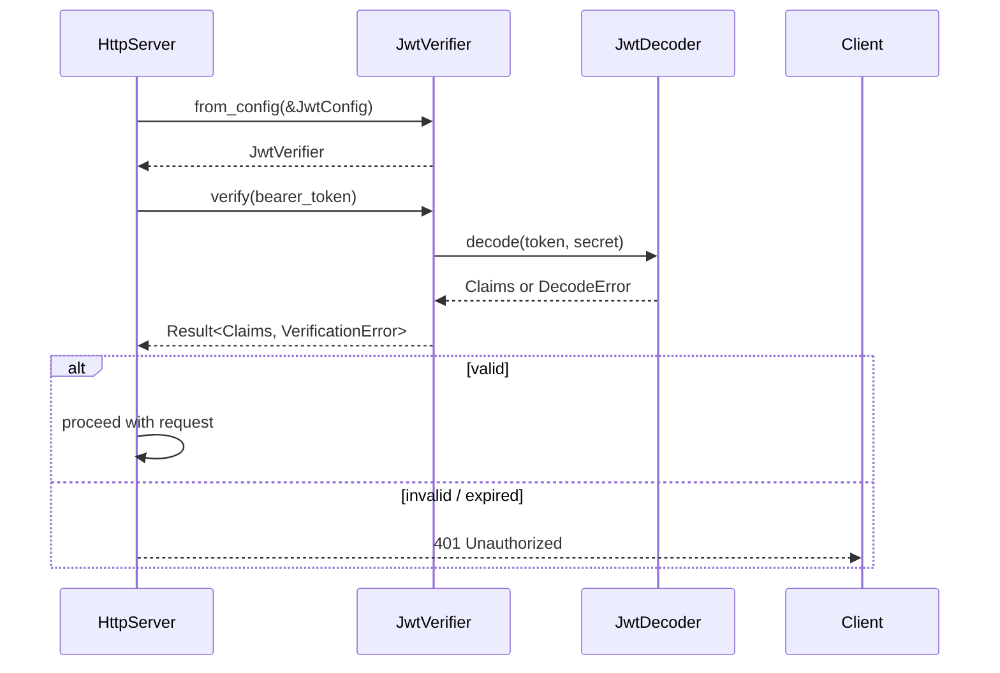
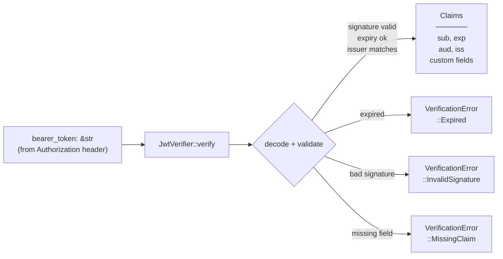
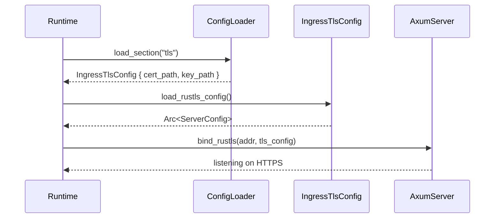
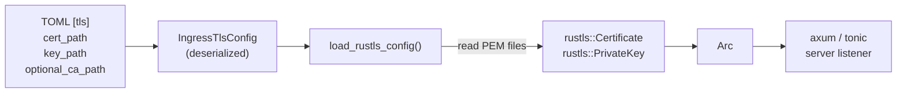

# Architecture — edge-ingress-security

Two crates in this workspace: `swe-edge-ingress-verifier` (JWT token verification) and `swe-edge-ingress-tls` (TLS configuration).

---

## Sequence — Token Verification

> An HTTP server extracts the `Authorization: Bearer <token>` header and verifies it via `JwtVerifier` before forwarding the request.

## Data Flow — Token Verification

> A raw bearer token enters `JwtVerifier`; validated claims or a typed error exit.

---

## Sequence — TLS Configuration

> TLS is loaded once at startup from TOML and applied to the axum/tonic server builder.

## Data Flow — TLS Configuration

> A TOML section becomes a `rustls::ServerConfig` used by the HTTP/gRPC listener.

